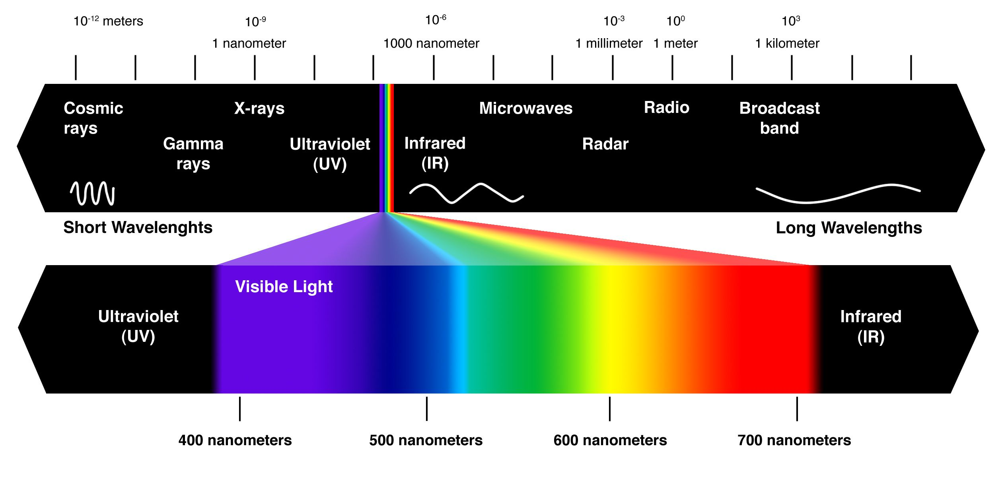
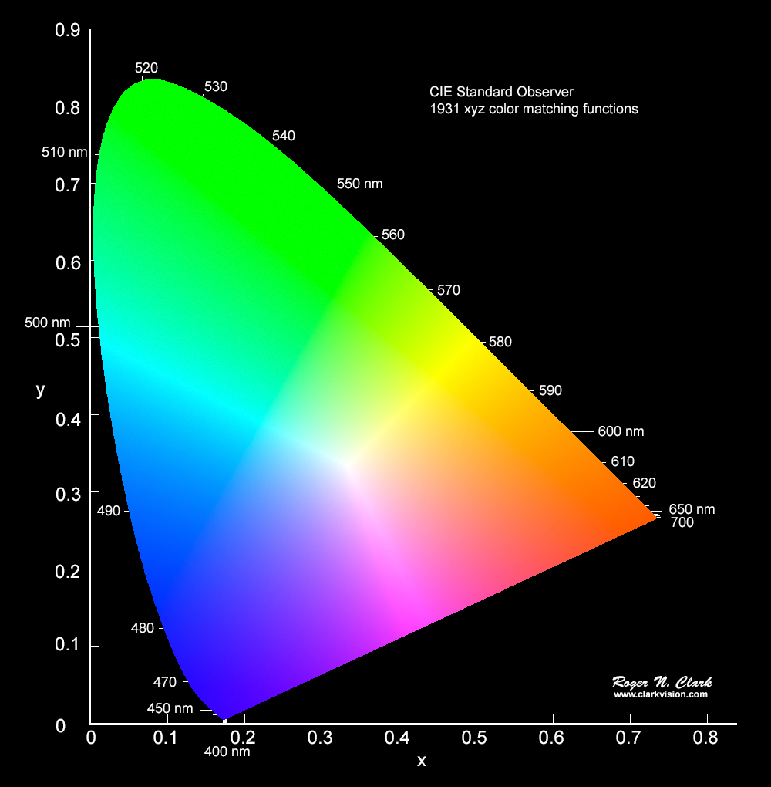
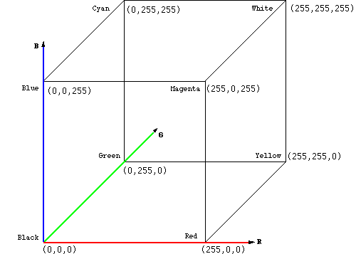
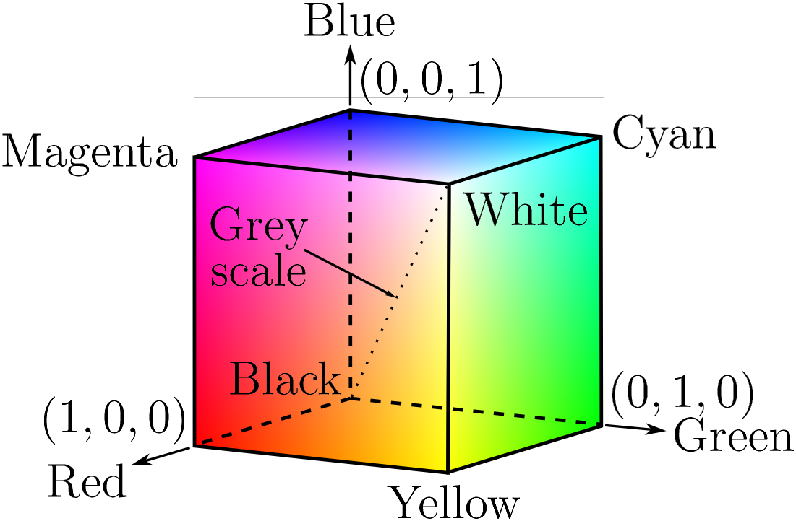
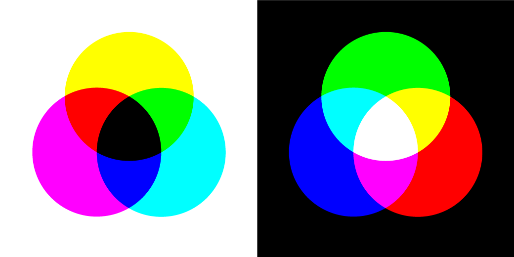
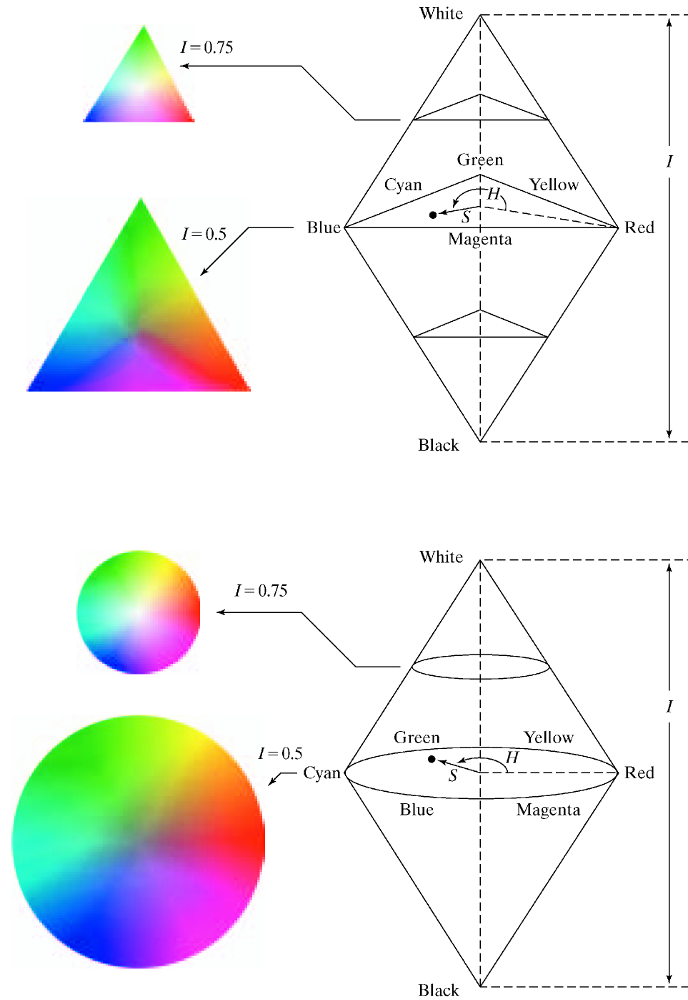
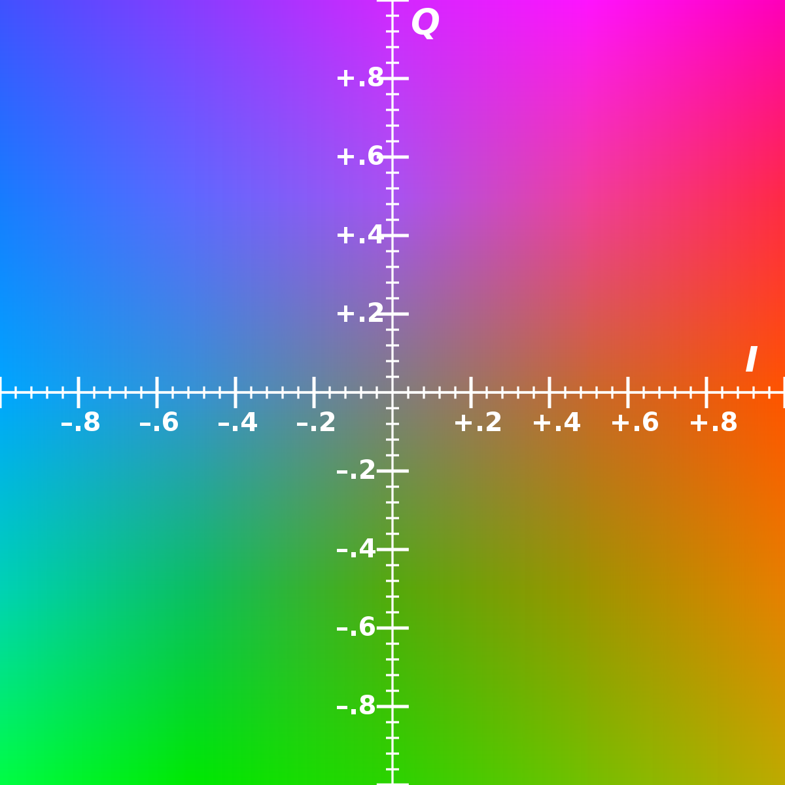

# Colour Image Processing
The human visual system can distinguish hundreds of thousands of different colour shades and intensities, but only around 100 shades of grey. Therefore, in an image, a great deal of extra information may be contained in the colour, and this extra information can then be used to simplify image analysis, e.g. object identification and extraction based on colour.

Three independent quantities are used to describe any particular colour. The hue is determined by the dominant wavelength. Visible colours occur between about 400nm (violet) and 700nm (red) on the electromagnetic spectrum.

The saturation is determined by the excitation purity, and depends on the amount of white light mixed with the hue. A pure hue is fully saturated, i.e. no white light mixed in. 

> Hue and saturation together determine the chromaticity for a given colour.

Finally, the intensity is determined by the actual amount of light, with more light corresponding to more intense colours.

> Achromatic light has no colour - its only attribute is quantity or intensity. Greylevel is a measure of intensity. The intensity is determined by the energy, and is therefore a physical quantity.

> On the other hand, brightness or luminance is determined by the perception of the colour, and is therefore psychological.

Given equally intense blue and green, the blue is perceived as much darker than the green. 

> Note also that our perception of intensity is nonlinear, with changes of normalised intensity from 0.1 to 0.11 and from 0.5 to 0.55 being perceived as equal changes in brightness.

## The CIE Chromaticity or The CIE Primaries
The CIE primaries are those defined by the CIE to make any colours in the visible spectrum. This was required as because it was found that we cannot create all possible visible colours using the three colours Red, Green and Blue.

So CIE primaries X, Y, Z whose coordinates in the chart is defined such that:

> 

> 

And as such,

> 

Thus only x and y is enough to calculate z and thus represent all colours.

## Colour Models
Colour models provide a standard way to specify a particular colour, by defining a 3-D coordinate system, and a subspace that contains all construct-able colours within a particular model. Any colour that can be specified using a model will correspond to a single
point within the subspace it defines. Each colour model is oriented towards either specific hardware (RGB, CMY, YIQ), or image processing applications (HSI).

### The RGB Model
In the RGB model, an image consists of three independent image planes, one in each of the primary colours: red, green and blue. Specifying a particular colour is by specifying the amount of each of the primary components present. The geometry of the RGB colour model for specifying colours using a Cartesian coordinate system is given below. The greyscale spectrum, i.e. those colours made from equal amounts of each primary, lies on the line joining the black and white vertices.

This is an additive model, i.e. the colours present in the light add to form new colours, and is appropriate for the mixing of coloured light. for example. The following image shows the additive mixing of red, green and blue primaries to form the three secondary colours yellow (red + green), cyan (blue + green) and magenta (red + blue), and white (red + green + blue).

The RGB model is used for colour monitors and most video cameras.

### The CMY Model
The CMY (cyan-magenta-yellow) model is a subtractive model appropriate to absorption of colours, for example due to pigments in paints. Whereas the RGB model asks what is added to black to get a particular colour, the CMY model asks what is subtracted from white. In this case, the primaries are cyan, magenta and yellow, with red, green and blue as secondary colours.

When a surface coated with cyan pigment is illuminated by white light, no red light is reflected, and similarly for magenta and green, and yellow and blue. The relationship between the RGB and CMY models is given by:

> 

The CMY model is used by printing devices and filters.

The figure on the right shows the additive mixing of red, green and blue primaries to form the three secondary colours yellow (red + green), cyan (blue + green) and magenta (red + blue), and white (red + green + blue). The figure on the left shows the three subtractive primaries, and their pairwise combinations to form red, green and blue, and finally black by subtracting all three primaries from white.

 

### The HSI Model 
As mentioned above, colour may be specified by the three quantities hue, saturation and intensity. This is the HSI model, and the entire space of colours that may be specified in this way is shown.

The HSI model, showing the HSI solid on the left, and the HSI triangle on the right, formed by taking a horizontal slice through the HSI solid at a particular intensity. Hue is measured from red, and saturation is given by distance from the axis. Colours on thesurface of the solid are fully saturated, i.e. pure colours, and the greyscale spectrum is on the axis of the solid. For these colours, hue is undefined. Conversion between the RGB model and the HSI model is quite complicated. The intensity is given by:

> 

where the quantities R, G and B are the amounts of the red, green and blue components, normalised to the range \[0,1\]. The intensity is therefore just the average of the red, green and blue components. The saturation is given by:

> }{I}&space;=&space;1&space;-&space;\frac{3}{R&plus;G&plus;B}&space;min(R,G,B))

where the min(R,G,B) term is really just indicating the amount of white present. If any of R, G or B are zero, there is no white and we have a pure colour.

### The YIQ Model
The YIQ (luminance-inphase-quadrature) model is a recoding of RGB for colour television, and is a very important model for colour image processing. The importance of luminance was discussed in the first section.

The Colour or IQ portion of the YIQ Model is given below:

The conversion from RGB to YIQ is given by:

> 

The luminance (Y) component contains all the information required for black and white television, and captures our perception of the relative brightness of particular colours. That we perceive green as much lighter than red, and red lighter than blue, is indicated by their respective weights of 0.587, 0.299 and 0.114 in the first row of the conversion matrix above. 

> These weights should be used when converting a colour image to greyscale if you want the perception of brightness to remain the same.

This is not the case for the intensity component in an HSI image. The Y component is the same as the CIE primary Y.

## Applying Greyscale Transformations to Colour Images
Given all these different representations of colour, and hence colour images, the question arises as to what is the best way to apply the image processing techniques we have covered so far to these images? 

In general it is better to apply the transformation to just the intensity component of an HSI image, or the luminance component of a YIQ image, thus leaving the chromaticity unaltered.

# Conclusion
Therefore, we can conclude that we must use just the Y component in an YIQ image and reject all other components to keep the luminance information and reject the chromacticity of the image, Thus converted to Grayscale.
